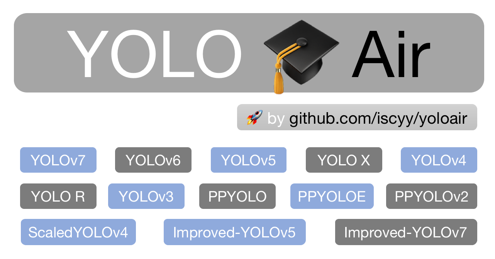

## YOLO Air : Makes improvements easy again

<div align="center">
<p>YOLOAir algorithm library is a combination toolbox of a series of YOLO detection algorithms based on PyTorch.🚀</p>
<p>Unified model code framework, unified application, unified improvement, easy module combination, building a more powerful network model.</p>
  <p>
    <a align="center" href="https://github.com/iscyy/yoloair" target="_blank">
      </a>
    <br><br>
  </p>

  English | [简体中文](./README.md)

       

  #### **Support**

       
        

[特性🚀](#main-features) • [使用🍉](#usage) • [文档📒](https://github.com/iscyy/yoloair) • [报告问题🌟](https://github.com/iscyy/yoloair/issues/new) • [更新💪](#-to-do) • [讨论✌️](https://github.com/iscyy/yoloair/discussions)


</div>

## Introduction

**Model diversification**: Build different detection network models based on different network modules.

**Module componentization**: Help users customize and quickly combine Backbone, Neck, Head, diversify network models, help scientific research improve detection algorithms, model improvements, and network permutation and combination 🏆. Build powerful network models.

**Unified model code framework, unified application method, unified parameter adjustment, unified improvement, Integrated multitasking, easy module combination, and more powerful network model building**.


Built-in YOLOv5, YOLOv7, YOLOv6, YOLOX, YOLOR, Transformer, PP-YOLO, PP-YOLOv2, PP-YOLOE, PP-YOLOEPlus, Scaled_YOLOv4, YOLOv3, YOLOv4, YOLO-Facev2, TPH-YOLO, YOLOv5Lite, SPD-YOLO, SlimNeck -Model network structures such as YOLO and PicoDet (continuously updated 🚀)...

The above multiple detection algorithms and related multi-task models use a unified model code framework, which is integrated in the YOLOAir library, and the application method is unified. It is convenient for researchers to improve the algorithm model of the paper, compare the models, and realize the diversification of the network combination. It includes lightweight models and models with higher accuracy, which are reasonably selected according to the scene, and strike a balance between accuracy and speed. At the same time, the library supports decoupling of different structures and module components to make modules componentized. By combining different module components, users can customize and build different detection models according to different data sets or different business scenarios.


Support integrated multi-task, including object detection, instance segmentation, image classification, pose estimation, face detection, object tracking and other tasks

```

██╗   ██╗ ██████╗ ██╗      ██████╗      █████╗     ██╗    ██████╗ 
╚██╗ ██╔╝██╔═══██╗██║     ██╔═══██╗    ██╔══██╗    ██║    ██╔══██╗
 ╚████╔╝ ██║   ██║██║     ██║   ██║    ███████║    ██║    ██████╔╝
  ╚██╔╝  ██║   ██║██║     ██║   ██║    ██╔══██║    ██║    ██╔══██╗
   ██║   ╚██████╔╝███████╗╚██████╔╝    ██║  ██║    ██║    ██║  ██║
   ╚═╝    ╚═════╝ ╚══════╝ ╚═════╝     ╚═╝  ╚═╝    ╚═╝    ╚═╝  ╚═╝
```

**Star🌟、Fork** 

Project address 🌟: https://github.com/iscyy/yoloair

Based on the YOLOv5 code framework, and synchronously adapted and updated.

______________________________________________________________________

### 🌟 Beta Supported Updates
The following functions are supported in YOLOAir-Beta version 🔥

- Complete update to support **20+ Transformer series and their variant backbone networks**🌟, **multiple MLP networks🌟** and **most re-parameterized structural model networks** 🚀🚀🚀
- Complete update support **Graph Neural Network**🌟 application in YOLO
- Complete update to support multi-modal 🔥 application in YOLO
- Complete update to support 30+ **Attention attention mechanisms** 🌟,
- Complete update support **Various Head detection heads**
- Completed update to support YOLOv6 model-v2.0 paper version
- Complete update support **YOLO series network model heatmap visualization**
(GardCAM, GardCAM++, etc.) Support models such as YOLOv3, YOLOv3-SPP, YOLOv4, YOLOv5, YOLOR, YOLOv7, Scaled_YOLOv4, TPH-YOLO, SPD-YOLO, PP-YOLO and custom network models
- Support Adaptive Training Sample Selection label assignment strategy and Task Alignment Learning label assignment strategy
- Finished updating the integrated PPYOLOE algorithm model
- Complete update integration TOOD algorithm
- other various
______________________________________________________________________

### 🌟 To Do

- Updated to support multitasking, including object detection, classification, instance segmentation tasks
______________________________________________________________________

### Main Features 🚀

🚀 Support more YOLO series algorithm model improvements (continuous update...)

The YOLOAir algorithm library summarizes a variety of mainstream YOLO series detection models, and a set of codes integrates multiple models:

- Built-in integrated YOLOv5 model network structure, YOLOv7 model network structure, YOLOv6 model network structure, PP-YOLO model network structure, PP-YOLOv2 model network structure, PP-YOLOE model network structure, PP-YOLOEPlus model network structure, YOLOR model network structure , YOLOX model network structure, ScaledYOLOv4 model network structure, YOLOv4 model network structure, YOLOv3 model network structure, YOLO-FaceV2 model network structure, TPH-YOLOv5 model network structure, SPD-YOLO model network structure, SlimNeck-YOLO model network structure, YOLOv5 -Lite model network structure, PicoDet model network structure, etc. are continuously updated...

🚀Support loading the official pre-training weights of YOLOv3, YOLOv4, YOLOv5, YOLOv7, YOLOR, Scaled_YOLO and other networks for transfer learning

🚀Support more Backbone

-  CSPDarkNet   
-  HorNet  
-  ResNet  
-  RegNet   
-  ShuffleNet  
-  Ghost  
-  MobileNet  
-  EfficientNet  
-  ConvNext  
-  RepLKNet  
-  RepVGG  
-  RepMLP  
-  ACNet
-  RepConv  
-  OREPA
-  Mobileone  
-  自注意力Transformer  
-  MobileViT
-  BoTNet-Transfomrer  
-  CoTNet-Transfomrer  
-  Swin-Transfomrer  
-  Swin-Transfomrer(v2)  
-  and other trans series
Continuous update 🎈🚀🚀🚀

🚀Support more Neck
- FPN  
- PANet  
- RepPAN
- BiFPN  
- CSPPAN
- SlimNeck
- ELANPAN
Continuous update 🎈🚀🚀🚀

🚀Support more Head  
-  YOLOv4、YOLOv5 Head;
-  YOLOR Head;
-  YOLOX Decoupled Head、DetectX Head;
-  ASFF Head;
-  YOLOv6-v2.0 Efficient decoupled head;
-  YOLOv7 IAuxDetect Head, IDetect Head;
-  PPYOLOE Efficient Task-aligned head with DFL and VFL

-  Other different detection heads

🚀Support more plug-and-play attention mechanisms Attention
- Plug-and-play use of attention mechanisms anywhere in the network
- Self Attention  
- Contextual Transformer  
- Bottleneck Transformer  
- S2-MLP Attention  
- SK Attention  
- CBAM Attention  
- SE Attention  
- Coordinate attention  
- NAM Attention  
- GAM Attention  
- ECA Attention  
- Shuffle Attention  
- CrissCrossAttention  
- Coordinate attention  
- SOCAttention  
- SimAM Attention 
Continuously updated 🎈


🚀More Spatial Pyramid Pooling Structures
- SPP
- SPPF
- ASPP
- RFB
- SPPCSPC  
- SPPFCSPC  
- SimSPPF
Continuously updated 🎈

🚀Support more Loss   
- ComputeLoss  
- ComputeLoss(v5)  
- ComputeLoss(v6)  
- ComputeLoss(X)  
- ComputeLossAuxOTA(v7)  
- ComputeLossOTA(v7)  
- ComputeNWDLoss  
- other Loss
Continuously updated 🎈

🚀Support Anchor-base 和 Anchor-Free  

- 🌟 YOLOv5、YOLOv7、YOLOv3、YOLOv4、YOLOR、ScaledYOLOv4、PPYOLO、PPYOLOv2、Improved-YOLOv5、Improved-YOLOv7

- 🌟 YOLOX、YOLOv6 (Paper)、PPYOLOE、PPYOLOE+

🚀Supports multiple label assignment strategies  
- Multi Anchor
- YOLOv5 Label assignment
- SimOTA Label assignment
- YOLOv7 Label assignment
- Adaptive Training Sample Selection Label assignment
- Task Alignment Learning Label assignment
- Other Improved Label Assignment Strategies
Continuously updated 🎈

🚀Supports Weighted Box Fusion (WBF)

🚀 Built-in multiple network model modular components
Conv, GhostConv, Bottleneck, GhostBottleneck, SPP, SPPF, DWConv, MixConv2d, Focus, CrossConv,BottleneckCSP, C3, C3TR, C3SPP, C3Ghost, C3HB, C3RFEM, MultiSEAM, SEAM, C3STR, SPPCSPC, RepConv, BoT3, Air, CA, CBAM, Involution, Stem, ResCSPC, ResCSPB, ResXCSPB, ResXCSPC, BottleneckCSPB, BottleneckCSPC, ASPP, BasicRFB, SPPCSPC_group, HorBlock, CNeB,C3GC ,C3C2, nn.ConvTranspose2d, DWConvblock, RepVGGBlock, CoT3, ConvNextBlock, SPPCSP, BottleneckCSP2, DownC, BottleneckCSPF, RepVGGBlock, ReOrg, DWT, MobileOne,HorNet...等详细代码 **./models/common.py文件** 内  

🚀Support for more IoU loss functions
- CIoU  
- DIoU  
- GIoU  
- EIoU  
- SIoU  
- alpha IOU  
Continuously updated 🎈

🚀Support more NMS
- NMS  
- Merge-NMS  
- Soft-NMS  
- CIoU_NMS  
- DIoU_NMS  
- GIoU_NMS  
- EIoU_NMS  
- SIoU_NMS  
- Soft-SIoUNMS、Soft-CIoUNMS、Soft-DIoUNMS、Soft-EIoUNMS、Soft-GIoUNMS等;    
Continuously updated 🎈

🚀Support for more data enhancements
- Mosaic、Copy paste、Random affine(Rotation, Scale, Translation and Shear)、MixUp、Augment HSV(Hue, Saturation, Value、Random horizontal flip  

🚀 YOLO series network model heat map visualization (GardCAM, GardCAM++, etc.)
Supports models such as YOLOv3, YOLOv3-SPP, YOLOv4, YOLOv5, YOLOR, YOLOv7Scaled_YOLOv4, TPH-YOLO, SPD-YOLO and custom network models (YOLOAir(Beta version)🔥Supported)

🚀Mainstream network model structure diagram summary: [Model 🔗](https://github.com/iscyy/yoloair/blob/main/docs/document/model_.md) 

The above component modules use a unified model code framework, unified task form, and unified application method. **Module componentization**🚀 can help users customize and quickly combine Backbone, Neck, and Head, diversify network models, and help scientific research improve detection algorithms. Build stronger network models.

Note: The above main features support include Main version and Beta version. Some features are only updated in Beta temporarily, not all updates are directly in Main, and will be gradually added to Main version after internal testing of subsequent Beta versions.

______________________________________________________________________

### Built-in network model configuration support ✨

🚀 Including various improved networks based on YOLOv5, YOLOv7, YOLOX, YOLOR, YOLOv3, YOLOv4, Scaled_YOLOv4, PPYOLO, PPYOLOE, PPYOLOEPlus, Transformer, YOLO-FaceV2, PicoDet, YOLOv5-Lite, TPH-YOLOv5, SPD-YOLO, etc.** Model configuration files for algorithmic models such as structures**
______________________________________________________________________

### Effect preview🚀

|Object detection|instance segmentation|
:-------------------------:|:-------------------------:
  |  

|Image classification|instance segmentation|
:-------------------------:|:-------------------------:
  |  

|instance segmentation|Object tracking|
:-------------------------:|:-------------------------:
  |  

|pose estimation|face detection|
:-------------------------:|:-------------------------:
  |  

|Heatmap visualization01|Heatmap visualization02|
:-------------------------:|:-------------------------:
  |  


### Pre-trained weights 🚀

- YOLOv5
https://github.com/ultralytics/yolov5/releases/tag/v6.1

- YOLOv4
https://github.com/iscyy/yoloair/releases/tag/v1.0

- YOLOv3
https://github.com/iscyy/yoloair/releases/tag/v1.0

- YOLOR
https://github.com/iscyy/yoloair/releases/tag/v1.0

- Scaled_YOLO
https://github.com/iscyy/yoloair/releases/tag/v1.0

- YOLOv7
https://github.com/iscyy/yoloair/releases/tag/v1.0

______________________________________________________________________

## Usage🍉

**About the code.** Follow the design principle of [YOLOv5](https://github.com/ultralytics/yolov5).  
The original version was created based on YOLOv5(v6.1)

### Install

Clone repo and install requirements.txt in a **Python>=3.7.0** environment, including **PyTorch>=1.7**. 
```bash
$ git clone https://github.com/iscyy/yoloair.git
$ cd yoloair
$ pip install -r requirements.txt
```

### Training

```bash
$ python train.py --data coco128.yaml --cfg configs/yolov5/yolov5s.yaml
```

### Inference

`detect.py` runs inference on a variety of sources,  saving results to `runs/detect`.

```bash
$ python detect.py --source 0  # webcam
                          img.jpg  # image
                          vid.mp4  # video
                          path/  # directory
                          path/*.jpg  # glob
```

### fusion
If you use different models to infer on the dataset, you can use the wbf.py file to integrate the results via weighted box fusion.
You just need to set img path and txt path in wbf.py file.
```bash
$ python wbf.py
```
______________________________________________________________________

### Performance
| Model                                                                                                | size<br><sup>(pixels) | mAP<sup>val<br>0.5:0.95 | mAP<sup>val<br>0.5 | Speed<br><sup>CPU b1<br>(ms) | Speed<br><sup>V100 b1<br>(ms) | Speed<br><sup>V100 b32<br>(ms) | params<br><sup>(M) | FLOPs<br><sup>@640 (B) | Weights
|------------------------------------------------------------------------------------------------------|-----------------------|-------------------------|--------------------|------------------------------|-------------------------------|--------------------------------|--------------------|------------------------|------------------------|
| YOLOv5n                   | 640                   | 28.0                    | 45.7               | **45**                       | **6.3**                       | **0.6**                        | **1.9**            | **4.5**                | [YOLOv5n](https://github.com/ultralytics/yolov5/releases/download/v6.1/yolov5n.pt)
| YOLOv5s                   | 640                   | 37.4                    | 56.8               | 98                           | 6.4                           | 0.9                            | 7.2                | 16.5                   | [YOLOv5s](https://github.com/ultralytics/yolov5/releases/download/v6.1/yolov5s.pt)
| YOLOv5m                   | 640                   | 45.4                    | 64.1               | 224                          | 8.2                           | 1.7                            | 21.2               | 49.0                   | [YOLOv5m](https://github.com/ultralytics/yolov5/releases/download/v6.1/yolov5m.pt)
| YOLOv5l                   | 640                   | 49.0                    | 67.3               | 430                          | 10.1                          | 2.7                            | 46.5               | 109.1                  | [YOLOv5l](https://github.com/ultralytics/yolov5/releases/download/v6.1/yolov5l.pt)
| YOLOv5x                   | 640                   | 50.7                    | 68.9               | 766                          | 12.1                          | 4.8                            | 86.7               | 205.7                  | [YOLOv5x](https://github.com/ultralytics/yolov5/releases/download/v6.1/yolov5x.pt)
|                                                                                                      |                       |                         |                    |                              |                               |                                |                    |                        |
| YOLOv5n6                 | 1280                  | 36.0                    | 54.4               | 153                          | 8.1                           | 2.1                            | 3.2                | 4.6                    |[YOLOv5n6](https://github.com/ultralytics/yolov5/releases/download/v6.1/yolov5n6.pt)
| YOLOv5s6                 | 1280                  | 44.8                    | 63.7               | 385                          | 8.2                           | 3.6                            | 12.6               | 16.8                   |[YOLOv5s6](https://github.com/ultralytics/yolov5/releases/download/v6.1/yolov5s6.pt)
| YOLOv5m6                 | 1280                  | 51.3                    | 69.3               | 887                          | 11.1                          | 6.8                            | 35.7               | 50.0                   |[YOLOv5m6](https://github.com/ultralytics/yolov5/releases/download/v6.1/yolov5m6.pt)
| YOLOv5l6                 | 1280                  | 53.7                    | 71.3               | 1784                         | 15.8                          | 10.5                           | 76.8               | 111.4                  |[YOLOv5l6](https://github.com/ultralytics/yolov5/releases/download/v6.1/yolov5l6.pt)
| YOLOv5x6<br>+ TTA | 1280<br>1536          | 55.0<br>**55.8**        | 72.7<br>**72.7**   | 3136<br>-                    | 26.2<br>-                     | 19.4<br>-                      | 140.7<br>-         | 209.8<br>-             |[YOLOv5x6](https://github.com/ultralytics/yolov5/releases/download/v6.1/yolov5x6.pt)

<details><summary> <b>Expand</b> </summary>

* The original version was created based on YOLOv5(6.1)

</details>

______________________________________________________________________

| Model                                                                                                | size<br><sup>(pixels) | mAP<sup>val<br>0.5:0.95 | mAP<sup>val<br>0.5 | deconv kernel size<br><sup> | Speed<br><sup>V100 b1<br>(ms) | Speed<br><sup>V100 b32<br>(ms) | params<br><sup>(M) | FLOPs<br><sup>@640 (B) |
|------------------------------------------------------------------------------------------------------|-----------------------|-------------------------|--------------------|------------------------------|-------------------------------|--------------------------------|--------------------|------------------------|
| YOLOv5s                   | 640                   | 33.7                    | 52.9               | -                       | **5.6**                       | **2.2**                        | **7.23**            | **16.5**                |
| YOLOv5s-deconv-exp1                   | 640                   | 33.4                    | 52.5               | 2                       | **5.6**                       | 2.4                        | 7.55            | 18.2                |
| YOLOv5s-deconv-exp2                   | 640                   | **34.7**                    | **54.2**               | 4                           | 5.8                           | 2.5                            | 8.54                | 23.2                   |
<details><summary> <b>Expand</b> </summary>

* The training process depends on 4xV100 GPU
```
# train
python -m torch.distributed.run --nproc_per_node 4 train.py --device 0,1,2,3 --data data/coco.yaml --hyp data/hyps/hyp.scratch-low.yaml  --cfg path/to/model.yaml --batch 512 --epochs 300 --weights ''
# val
python val.py --verbose --data data/coco.yaml --conf 0.001 --iou 0.65 --batch 1 --weights path/to/model.pt
```
* There is a gap between the mAP of YOLOv5s and the official one, here is just for comparison
</details>

______________________________________________________________________

| Model                                                                                                | size<br><sup>(pixels) | mAP<sup>val<br>0.5:0.95 | mAP<sup>val<br>0.5 | params<br><sup>(M) | FLOPs<br><sup>@640 (B) |
|------------------------------------------------------------------------------------------------------|-----------------------|-------------------------|--------------------------------|--------------------|------------------------|
| YOLOv5s                   | 640                   | 37.4                       | 56.6                        | **7.226**            | **16.5**                |
| YOLOv5s-deconv             | 640                   | **37.8**                       | **57.1**                        | 7.232            | **16.5**                |

<details><summary> <b>Expand</b> </summary>

* tested the 4x4 depthwise-separable deconv by setting the groups as input_channel
* their params number and FLOPS are nearly the same while the new model's mAP is about 0.4 higher than the origin.
</details>

______________________________________________________________________

| Model                                                                                                | size<br><sup>(pixels) | mAP<sup>val<br>0.5:0.95 | mAP<sup>val<br>0.5 | params<br><sup>(M) | FLOPs<br><sup>@640 (B) |
|------------------------------------------------------------------------------------------------------|-----------------------|-------------------------|--------------------------------|--------------------|------------------------|
| YOLOv5s                   | 640                   | 37.2                       | 56.0                        | **7.2**            | **16.5**                |
| YOLOv5s-C3GC-backbone             | 640                   | **37.7**                       | **57.3**                        | 7.5            | 16.8                |

<details><summary> <b>Expand</b> </summary>

* The original version was created based on YOLOv5-6.0
</details>

______________________________________________________________________

### YOLOv5 official tutorial ✨
Sync with YOLOv5 framework

- [Train Custom Data](https://github.com/ultralytics/yolov5/wiki/Train-Custom-Data)  🚀 RECOMMENDED
- [Tips for Best Training Results](https://github.com/ultralytics/yolov5/wiki/Tips-for-Best-Training-Results)  ☘️ RECOMMENDED
- [Multi-GPU Training](https://github.com/ultralytics/yolov5/issues/475)
- [PyTorch Hub](https://github.com/ultralytics/yolov5/issues/36) 🌟 NEW
- [TFLite, ONNX, CoreML, TensorRT Export](https://github.com/ultralytics/yolov5/issues/251) 🚀
- [Test-Time Augmentation (TTA)](https://github.com/ultralytics/yolov5/issues/303)
- [Model Ensembling](https://github.com/ultralytics/yolov5/issues/318)
- [Model Pruning/Sparsity](https://github.com/ultralytics/yolov5/issues/304)
- [Hyperparameter Evolution](https://github.com/ultralytics/yolov5/issues/607)
- [Transfer Learning with Frozen Layers](https://github.com/ultralytics/yolov5/issues/1314)
- [Architecture Summary](https://github.com/ultralytics/yolov5/issues/6998) 🌟 NEW
- [Weights & Biases Logging](https://github.com/ultralytics/yolov5/issues/1289)
- [Roboflow for Datasets, Labeling, and Active Learning](https://github.com/ultralytics/yolov5/issues/4975)  🌟 NEW
- [ClearML Logging](https://github.com/ultralytics/yolov5/tree/master/utils/loggers/clearml) 🌟 NEW
- [Deci Platform](https://github.com/ultralytics/yolov5/wiki/Deci-Platform) 🌟 NEW

______________________________________________________________________


### Future enhancement ✨
In the future, we will continue to build and improve the YOLOAir ecosystem
Improve and integrate more YOLO series models, continue to combine different modules to build more different network models
Horizontal expansion and introduction of associative techniques, such as semi-supervised learning, etc.

______________________________________________________________________

## Citation✨

```python
@article{2022yoloair,
  title={{YOLOAir}: Makes improvements easy again},
  author={iscyy},
  repo={github https://github.com/iscyy/yoloair},
  year={2022}
}
```

## Statement
<details><summary> <b>Expand</b> </summary>

* The content of this site is only for sharing notes. If some content is infringing, please sending email.

* If you have any question, please discuss with me by sending email.
</details>

## Acknowledgements

<details><summary> <b>Expand</b> </summary>

[https://github.com/ultralytics/yolov5](https://github.com/ultralytics/yolov5)  
[https://github.com/ultralytics/yolov3](https://github.com/ultralytics/yolov3)  
[https://github.com/WongKinYiu/PyTorch_YOLOv4](https://github.com/WongKinYiu/PyTorch_YOLOv4)  
[https://github.com/WongKinYiu/ScaledYOLOv4](https://github.com/WongKinYiu/ScaledYOLOv4)   
[https://github.com/meituan/YOLOv6](https://github.com/meituan/YOLOv6)  
[https://github.com/WongKinYiu/yolov7](https://github.com/WongKinYiu/yolov7)  
[https://github.com/WongKinYiu/yolor](https://github.com/WongKinYiu/yolor)   
[https://github.com/xmu-xiaoma666/External-Attention-pytorch](https://github.com/xmu-xiaoma666/External-Attention-pytorch)  
[https://gitee.com/SearchSource/yolov5_yolox](https://gitee.com/SearchSource/yolov5_yolox)  
[https://github.com/Krasjet-Yu/YOLO-FaceV2](https://github.com/Krasjet-Yu/YOLO-FaceV2)  
[https://github.com/positive666/yolov5_research/](https://github.com/positive666/yolov5_research)  
[https://github.com/ppogg/YOLOv5-Lite](https://github.com/ppogg/YOLOv5-Lite)  
[https://github.com/Gumpest/YOLOv5-Multibackbone](https://github.com/Gumpest/YOLOv5-Multibackbone-Compression)  
[https://github.com/cv516Buaa/tph-yolov5](https://github.com/cv516Buaa/tph-yolov5)

</details>