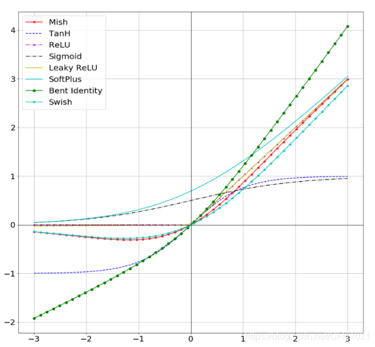

#### 🌟activation function
<div align='center'>

</div>

* **SiLU**

```python
# SiLU activation https://arxiv.org/pdf/1606.08415.pdf
# 代码(./utils/activations.py文件内搜索🔍)
class SiLU(nn.Module):
    ...
```
* **Hardswish**
```python
# Hard-SiLU activation
# 代码(./utils/activations.py文件内搜索🔍)
class Hardswish(nn.Module):
    ...
```
* **Mish**
```python
# Mish activation https://github.com/digantamisra98/Mish
# 代码(./utils/activations.py文件内搜索🔍)
class Mish(nn.Module):
    ...
```
* **MemoryEfficientMish**
```python
# Mish activation memory-efficient
# 代码(./utils/activations.py文件内搜索🔍)
class MemoryEfficientMish(nn.Module):
    ...
```
* **FReLU**
```python
# FReLU activation https://arxiv.org/abs/2007.11824
# 代码(./utils/activations.py文件内搜索🔍)
class FReLU(nn.Module):
    ...
```
* **AconC**
```python
r""" ACON activation (activate or not)
    AconC: (p1*x-p2*x) * sigmoid(beta*(p1*x-p2*x)) + p2*x, beta is a learnable parameter
    according to "Activate or Not: Learning Customized Activation" <https://arxiv.org/pdf/2009.04759.pdf>.
    """
# 代码(./utils/activations.py文件内搜索🔍)
class AconC(nn.Module):
    ...
```
* **MetaAconC**
```python
r""" ACON activation (activate or not)
    MetaAconC: (p1*x-p2*x) * sigmoid(beta*(p1*x-p2*x)) + p2*x, beta is generated by a small network
    according to "Activate or Not: Learning Customized Activation" <https://arxiv.org/pdf/2009.04759.pdf>.
    """
# 代码(./utils/activations.py文件内搜索🔍)
class MetaAconC(nn.Module):
    ...
```
______________________________________________________________________